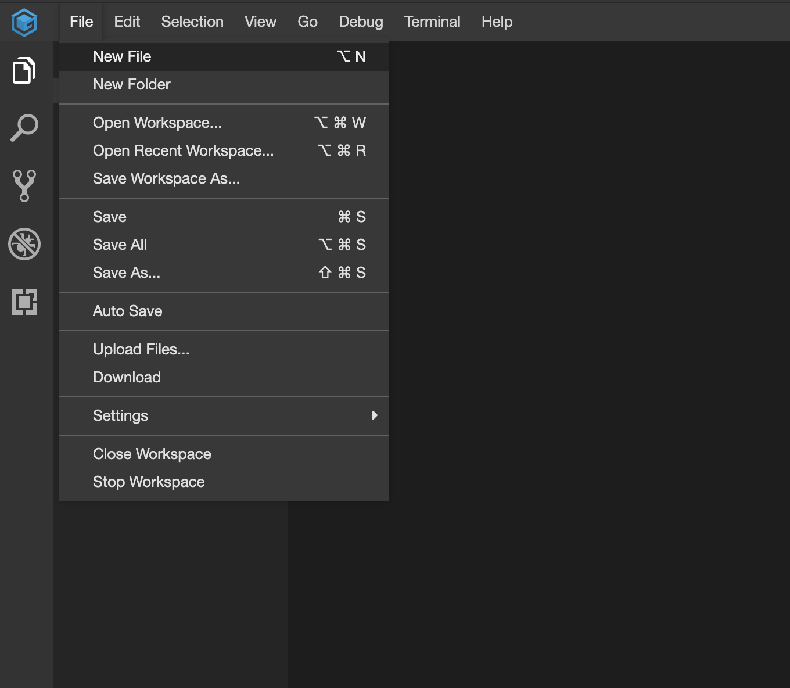
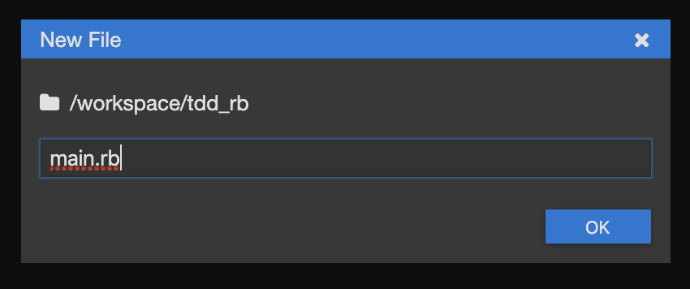
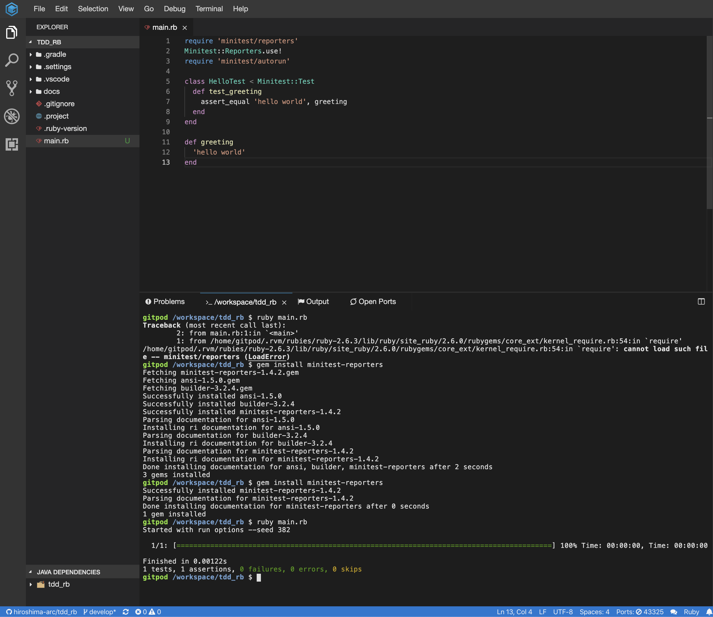

# テスト駆動開発から始めるRuby入門

## 概要

## 前提

| ソフトウェア   | バージョン | 備考 |
| :------------- | :--------- | :--- |
| ruby         | 2.5.5     |      |

### Quick Start

#### 以下のリンクからクラウドIDEを起動する

[](https://gitpod.io/#https://github.com/hiroshima-arc/tdd_rb)


#### IDEが起動したら `main.rb` ファイルを作成して開発を進めていきます。







開発の進め方は [テスト駆動開発から始めるRuby入門 Qiita](https://qiita.com/k2works/items/83741e3e2d2579d748d6) に沿って進めてください。

#### 仮想マシン使用の場合

```bash
$ vagrant up
$ vagrant ssh
$ cd /vagrant
```

シンボルリンクを作成してデバッガを使えるようにする

```bash
gem install ruby-debug-ide
gem install debase
gem install rubocop
gem install rcodetools
sudo ln -s ~/.rbenv/shims/rdebug-ide /usr/local/bin/
sudo ln -s ~/.rbenv/shims/rubocop /usr/local/bin/
sudo ln -s ~/.rbenv/shims/rct-complete /usr/local/bin/
```

Node.jsをインストールする

```bash
nvm install --lts
node -v
```

