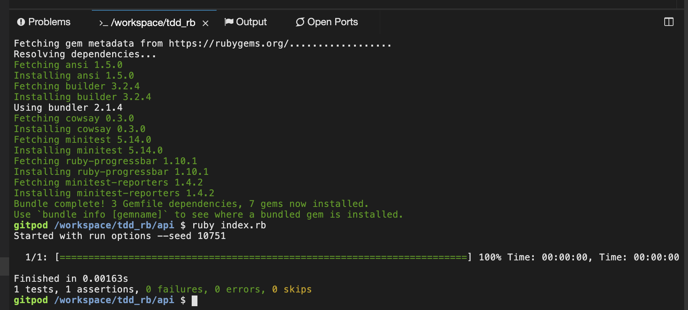
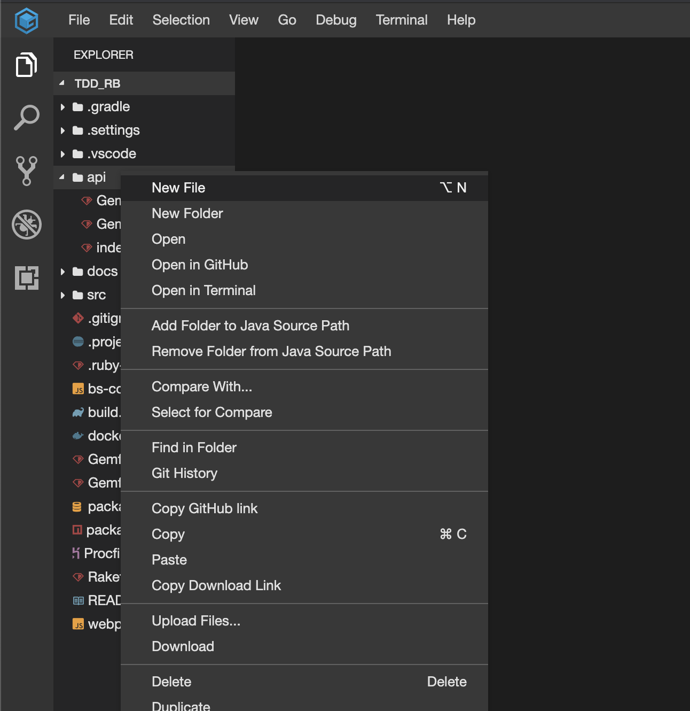
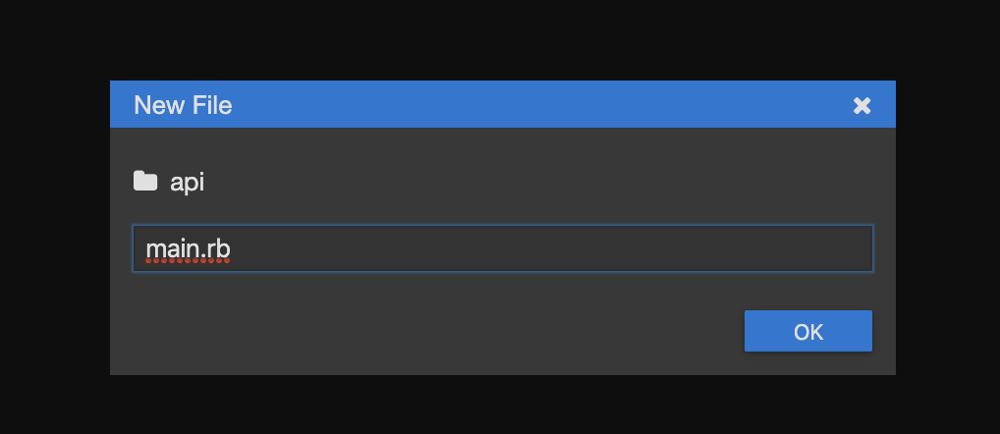
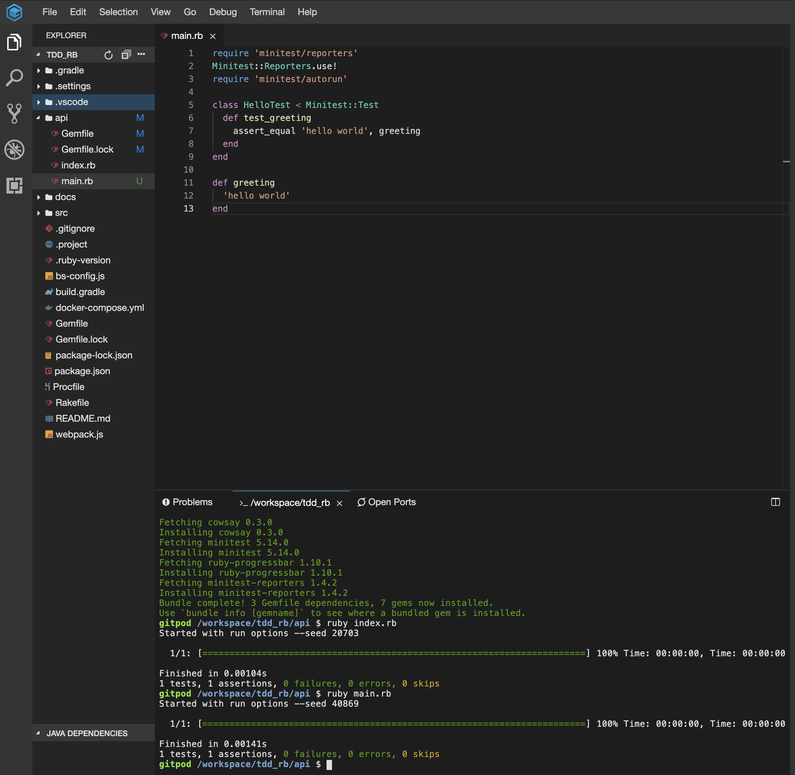

# テスト駆動開発から始めるRuby入門

## 概要

## 前提

| ソフトウェア   | バージョン | 備考 |
| :------------- | :--------- | :--- |
| ruby         | 2.5.5     |      |

### Quick Start

#### 以下のリンクからクラウドIDEを起動する

[](https://gitpod.io/#https://github.com/hiroshima-arc/tdd_rb)


#### IDEが起動したらターミナルに以下のコマンドを入力する

```bash
cd api
gem update bundler
bundle intsall
ruby index.rb
```



#### apiフォルダ以下に `main.rb` ファイルを作成して開発を進める







**[⬆ back to top](#構成)**

## 参照

- [テスト駆動開発から始めるRuby入門 Qiita](https://qiita.com/k2works/items/83741e3e2d2579d748d6)