:toc: left
:toclevels: 5
:sectnums:
:source-highlighter: coderay

=== 環境構築から始めるテスト駆動開発

==== 6S

環境構築をするにあたっては *5S* + セキュリティの *6S* をベースに進めていきます。まず *5S* について、それからセキュリティについて解説します。

===== 5S

[quote, Wikipedia, 'https://ja.wikipedia.org/wiki/5S']
____
5S（ごエス、ごーエス）とは、製造業・サービス業などの職場環境の維持改善で用いられるスローガンである。各職場において徹底されるべき事項を5つにまとめたもので、4S運動に「躾」（習慣化の場合もある）を加えた5項。
____

具体的には、

* 整理（せいり、Seiri）
  いらないものを捨てる

* 整頓（せいとん、Seiton）
  決められた物を決められた場所に置き、いつでも取り出せる状態にしておく

* 清掃（せいそう、Seisou）
  常に掃除をする

* 清潔（せいけつ、Seiketsu）
  3S（上の整理・整頓・清掃）を維持し職場の衛生を保つ

* 躾（しつけ、Shitsuke）
  決められたルール・手順を正しく守る習慣をつける

これがプログラミング環境構築とどのように関係していくのでしょうか？

いらないものを捨てるのが整理ですがそもそもいらないものが何なのかを決めなければなりません。プログラミングで扱う対象はモノではなく情報です。ではどうやって情報を扱って行けばよいでしょう？まずは *分類するな。ひたすら並べよ* の考えに従い一箇所に記録をまとめていきましょう。そのためのテクニックとして *エンジニアリングデイブックス* があります。これは何をやったか何を学んだかをノートに時系列に記録していくことです。

Engineering Dayboks

[quote, Pragmatic Programmer: your journey to mastery, 20th Anniversary Edition, 'https://www.oreilly.com/library/view/the-pragmatic-programmer/9780135956977/f_0041.xhtml[Engineering Daybooks]']
____
Eventually Dave asked the obvious question. It turned out that they’d been trained to keep an engineering daybook, a kind of journal in which they recorded what they did, things they’d learned, sketches of ideas, readings from meters: basically anything to do with their work. When the notebook became full, they’d write the date range on the spine, then stick it on the shelf next to previous daybooks. ...
____

ノートは市販のものならどれでも構いませんがおすすめは https://www.kokuyo-st.co.jp/stationery/softring-note/[ソフトリングノード^] のB5サイズが手元に置いてもかさばらず使いやすいです。情報を一箇所に集めて必要なものと不要なものを分ける準備が出来ました。次は必要なものをすぐに取り出せるようにする *整頓* をどのように実践していくかを解説します。

情報を扱う場合の *整頓* の基本は *分類するな。ひたすら並べよ* です。デジタルデータも一箇所に保存していきましょう。具体的に保存する場所は後で解説します。また、分類するなといっても分類をする必要は当然発生します。分類にあたっては一貫したネーミングルールを適用していきます。具体的な方法は都度解説していきます。

[quote, Pragmatic Programmer: your journey to mastery, 20th Anniversary Edition, 'https://www.oreilly.com/library/view/the-pragmatic-programmer/9780135956977/f_0041.xhtml[Engineering Daybooks]']
____
Name Well; Rename When Needed.

Name to express your intent to readers, and rename as soon as that intent shifts.
____

基本は実践しなければ意味がありませんそして習慣にすることで初めてものにできるものです。そのためには自ら躾けていかなければなりません。

[quote, テスト駆動開発]
____
私がかつて発見した、そして多くの人に気づいてもらいたい効果とは、反復可能な振る舞いを規則にまで還元することで、規則の適用は機会的に反復可能になるということだ。
____

[quote, リファクタリング(第2版)]
____
ここで、Kent Beckが自ら語ったセリフを思い出しました。「僕は、偉大なプログラマなんかじゃない。偉大な習慣を身につけた少しましなプログラマなんだ」。
____

===== セキュリティ(Security)

*5S* に続いてセキュリティに関してですがここで扱う内容は *情報セキュリティ* に関する内容です。

[quote, Wikipedia, 'https://ja.wikipedia.org/wiki/%E6%83%85%E5%A0%B1%E3%82%BB%E3%82%AD%E3%83%A5%E3%83%AA%E3%83%86%E3%82%A3']
____
情報セキュリティ（じょうほうセキュリティ、英: information security）とは、情報の機密性、完全性、可用性を維持すること。
____

ここではパスワードに関する基本だけ抑えておいてください。

[quote, 子どもに「パスワード」の付け方を教えられますか？, 'https://www.itmedia.co.jp/pcuser/articles/1808/09/news035.html[子どもを守るITリテラシー学^]']
____
* 誕生日や電話番号など、親が見てパッと理解できる文字列はダメ
* 1単語で“読めてしまう”文字列はダメ
* 8文字以下の文字列は短すぎるからダメ
____

実際にパスワードを設定するときは

[quote, 子どもに「パスワード」の付け方を教えられますか？, 'https://www.itmedia.co.jp/pcuser/articles/1808/09/news035.html[子どもを守るITリテラシー学^]']
____
* サービスごとに、3単語以上の英文字を並べる（例：pekinese-optimal-start）
* なるべく長いパスワードを用意する（例：nagai-pasuwa-do-wo-youi-suru-amari-iirei-deha-naiga）
* 辞書に載っていないような文字列を用意する（例：Itags80vZyMp）
____

を参考にしてください。

===== ITリテラシ

プログラミング環境構築にあたっての基本は解説しました。この記事ではソフトウェア開発のための *ITリテラシ* 習得のベースとなる環境構築をすることを目的としています。

[quote, https://t-wada.hatenablog.jp/entry/clean-code-that-works]
____
今日のソフトウェア開発の世界において絶対になければならない3つの技術的な柱があります。 三本柱と言ったり、三種の神器と言ったりしていますが、それらは

* バージョン管理
* テスティング
* 自動化

の3つです。
____

==== アカウントの登録

まず各種サービスのアカウントを登録します。

===== Microsoftアカウントを作成する

https://signup.live.com/signup?wa=wsignin1.0&rpsnv=13&rver=7.3.6963.0&wp=MBI_SSL&wreply=https%3a%2f%2fwww.microsoft.com%2fja-jp%2f&id=74335&aadredir=1&contextid=E56866F842F4E143&bk=1584685585&uiflavor=web&lic=1&mkt=JA-JP&lc=1041&uaid=491fc017de0f48c5c67a3833e7aca9ee[アカウントの作成^] から新しいメールアドレスを取得を選択します。

image::../../images/article/episode_0/ms-001.png[]
image::../../images/article/episode_0/ms-002.png[]
image::../../images/article/episode_0/ms-003.png[]
image::../../images/article/episode_0/ms-004.png[]
image::../../images/article/episode_0/ms-005.png[]
image::../../images/article/episode_0/ms-006.png[]


===== Googleアカウントを作成する

https://support.google.com/accounts/answer/27441?hl=ja[Google アカウントの作成^] から `Googleアカウントを作成する` を選択します。

image::../../images/article/episode_0/ggl-001.png[]
image::../../images/article/episode_0/ggl-002.png[]
image::../../images/article/episode_0/ggl-003.png[]

===== GitHubアカウントを作成する

https://github.co.jp/[GitHubに登録する^] から `GitHubに登録する` を選択します。


image::../../images/article/episode_0/ghb-001.png[]
image::../../images/article/episode_0/ghb-002.png[]
image::../../images/article/episode_0/ghb-003.png[]

===== アカウントにサインインする

https://support.microsoft.com/ja-jp/help/4028195[Microsoft アカウントにサインインする方法^] を参考にしてローカルアカウントからMicrosoftアカウントに切り替えます。

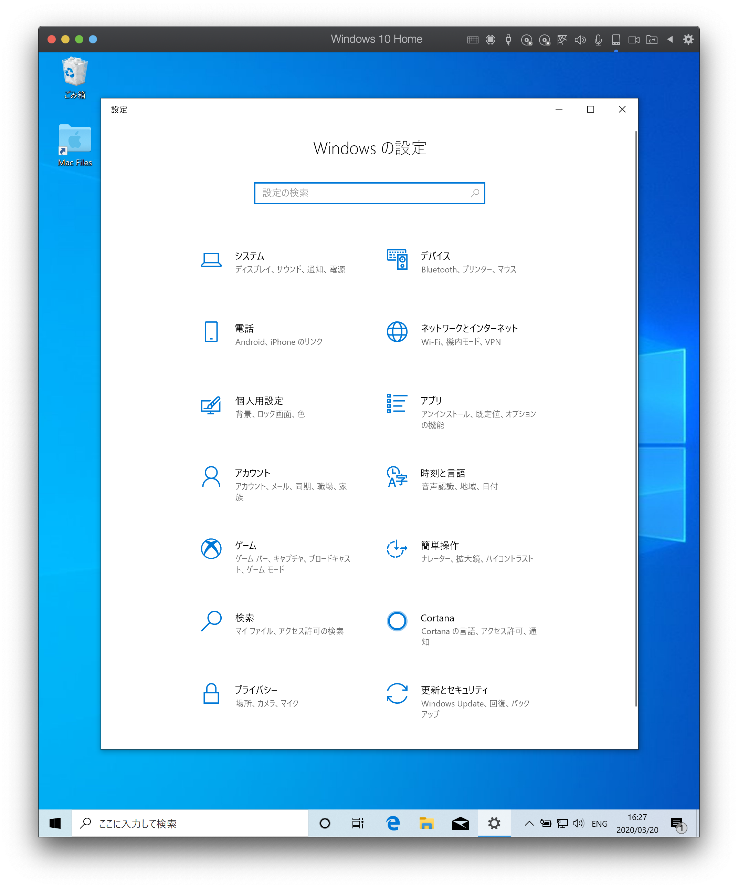
image::../../images/article/episode_0/login-002.png[]
image::../../images/article/episode_0/login-003.png[]
image::../../images/article/episode_0/login-004.png[]
image::../../images/article/episode_0/login-005.png[]
image::../../images/article/episode_0/login-006.png[]
image::../../images/article/episode_0/login-007.png[]

==== クラウドストレージのセットアップ

[quote, Pragmatic Programmer: your journey to mastery, 20th Anniversary Edition, 'https://www.oreilly.com/library/view/the-pragmatic-programmer/9780135956977/f_0041.xhtml[Engineering Daybooks]']
____
Keep Knowledge in Plain Text

Plain text won't become obsolete.It helps leverage your work and simplifies debugging and testing.
____

https://products.office.com/ja-jp/home?SilentAuth=1[Office365^] からOneDriveの設定を確認します。

image::../../images/article/episode_0/drive-001.png[]
image::../../images/article/episode_0/drive-002.png[]
image::../../images/article/episode_0/drive-003.png[]

アカウントのパスワードなど機密情報は https://support.office.com/ja-jp/article/personal-vault-で-onedrive-ファイルを保護する-6540ef37-e9bf-4121-a773-56f98dce78c4[Personal Vault で OneDrive ファイルを保護する^] を使って管理すると良いでしょう。もしくは https://1password.com/jp/[1Password] などパスワード管理ツールの導入を検討してください。


https://support.microsoft.com/ja-jp/help/17184/windows-10-onedrive[PCのOneDrive^] にあるようにデータはローカルとクラウドの両方にあるので破損・紛失をしても復旧することが出来ます。

==== パッケージ管理ツールのセットアップ

アプリケーションの管理にはパッケージ管理ツール https://chocolatey.org/[The Package Manager for Windows^] を使います。インストールの方法は https://qiita.com/konta220/items/95b40b4647a737cb51aa[Chocolateyを使った環境構築の時のメモ^] を参照してください。

==== エディタのセットアップ

[quote, Pragmatic Programmer: your journey to mastery, 20th Anniversary Edition, 'https://www.oreilly.com/library/view/the-pragmatic-programmer/9780135956977/f_0041.xhtml[Engineering Daybooks]']
____
Achieve Editor Fluency

An editor is your most important tool. Know how to make it do what you need, quickly and accurately.
____


===== インストール
https://aka.ms/vscode-java-installer-win[Download Visual Studio Code Java Pack Installer] からVSCodeをダウンロードしてセットアッププログラムを実行します。

image::../../images/article/episode_0/vscode-001.png[]
image::../../images/article/episode_0/vscode-002.png[]
image::../../images/article/episode_0/vscode-003.png[]

===== 拡張機能の追加

https://marketplace.visualstudio.com/items?itemName=MS-CEINTL.vscode-language-pack-ja[Japanese Language Pack for Visual Studio Code^]

image::../../images/article/episode_0/vscode-004.png[]
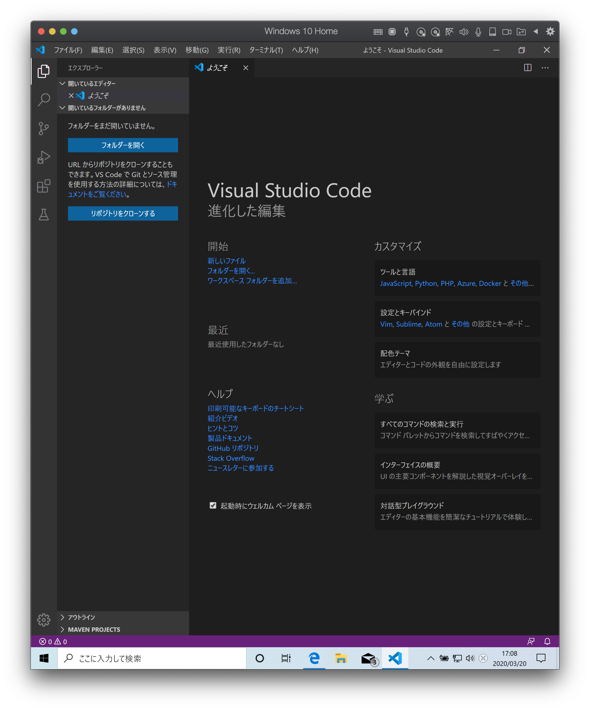

https://qiita.com/sensuikan1973/items/74cf5383c02dbcd82234[VSCodeのオススメ拡張機能 24 選 (とTipsをいくつか)^]

===== 設定の同期

https://marketplace.visualstudio.com/items?itemName=Shan.code-settings-sync[Settings Sync^]

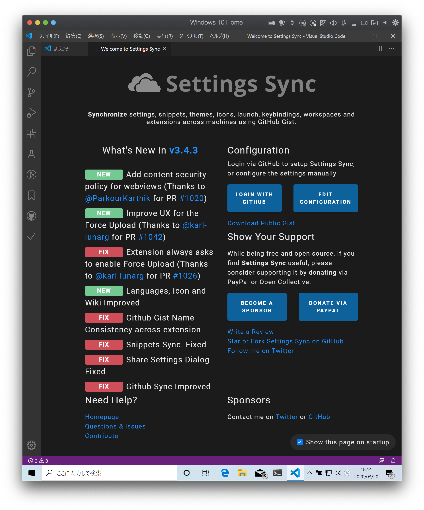
image::../../images/article/episode_0/sync-002.png[]
image::../../images/article/episode_0/sync-003.png[]
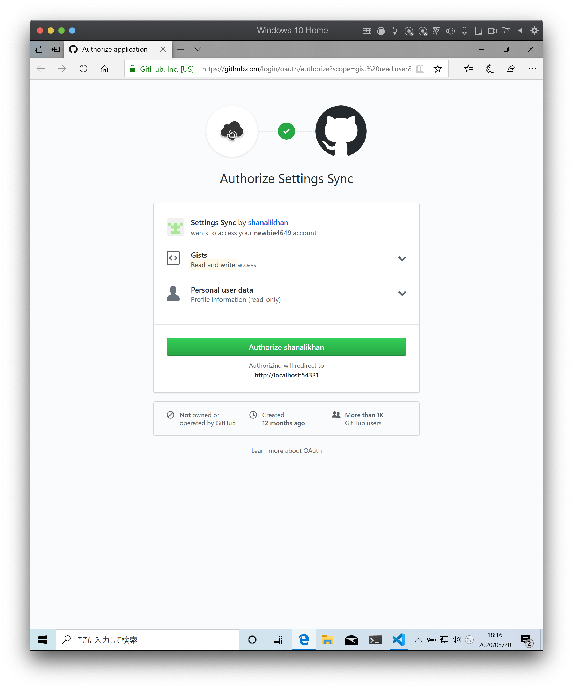
image::../../images/article/episode_0/sync-005.png[]
image::../../images/article/episode_0/sync-006.png[]
image::../../images/article/episode_0/sync-007.png[]
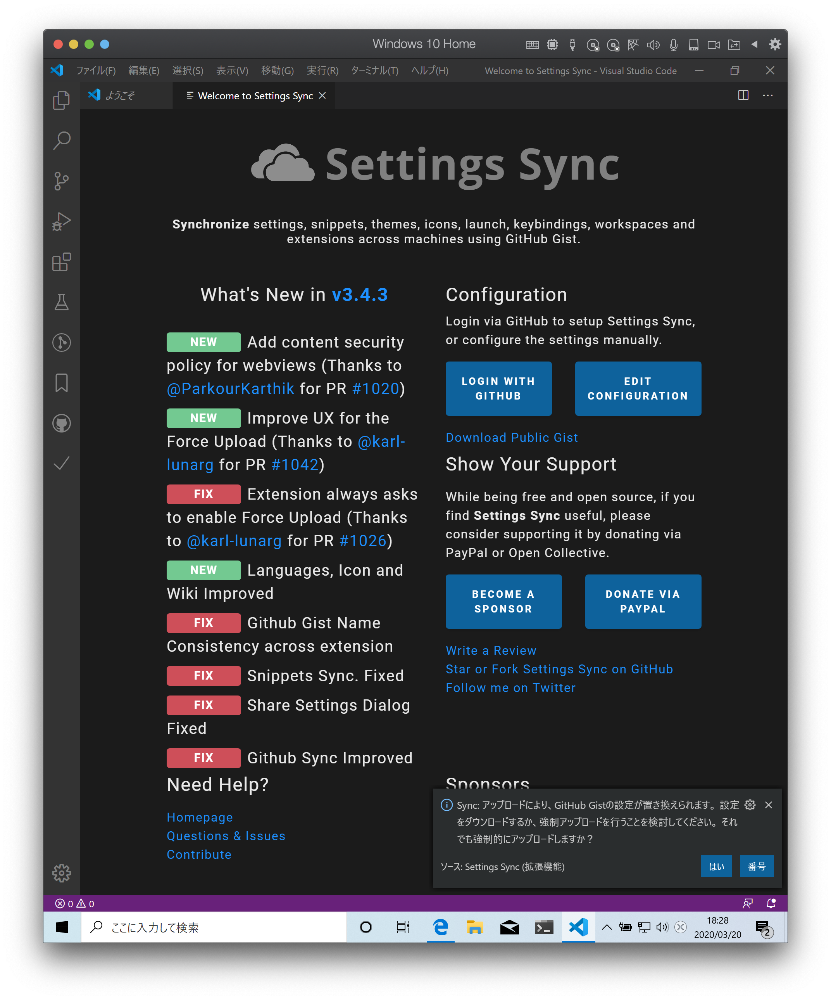

==== 開発環境のセットアップ

[quote, Pragmatic Programmer: your journey to mastery, 20th Anniversary Edition, 'https://www.oreilly.com/library/view/the-pragmatic-programmer/9780135956977/f_0041.xhtml[Engineering Daybooks]']
____
Always Use Version Control

Vsersion control is a time machine for your work;you can go back.
____

===== gitのインストール

```
choco install git
```

===== Windows Terminalのインストール

[quote, Pragmatic Programmer: your journey to mastery, 20th Anniversary Edition, 'https://www.oreilly.com/library/view/the-pragmatic-programmer/9780135956977/f_0041.xhtml[Engineering Daybooks]']
____
Use the Power of Command Shells

Use the shell when graphical user interfaces don't cut it.
____

image::../../images/article/episode_0/terminal-001.png[]
image::../../images/article/episode_0/terminal-002.png[]
image::../../images/article/episode_0/terminal-003.png[]

===== PowerShellCoreのインストール

```
choco install pwershell-core
```

===== WSLのインストール

image::../../images/article/episode_0/wsl-001.png[]
image::../../images/article/episode_0/wsl-002.png[]
image::../../images/article/episode_0/wsl-003.png[]
image::../../images/article/episode_0/wsl-004.png[]
image::../../images/article/episode_0/wsl-005.png[]
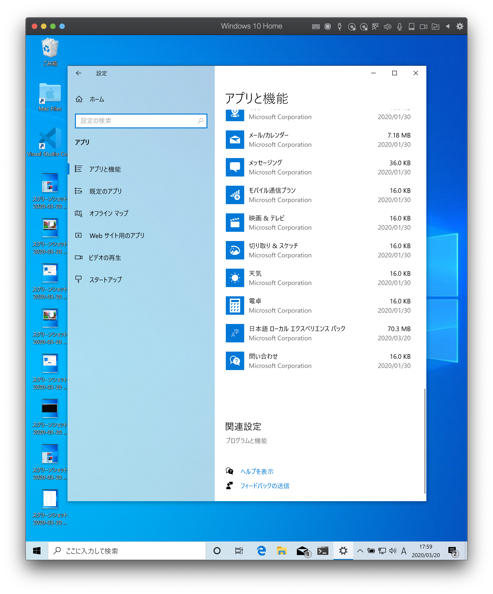
image::../../images/article/episode_0/wsl-007.png[]
image::../../images/article/episode_0/wsl-008.png[]
image::../../images/article/episode_0/wsl-009.png[]
image::../../images/article/episode_0/wsl-010.png[]
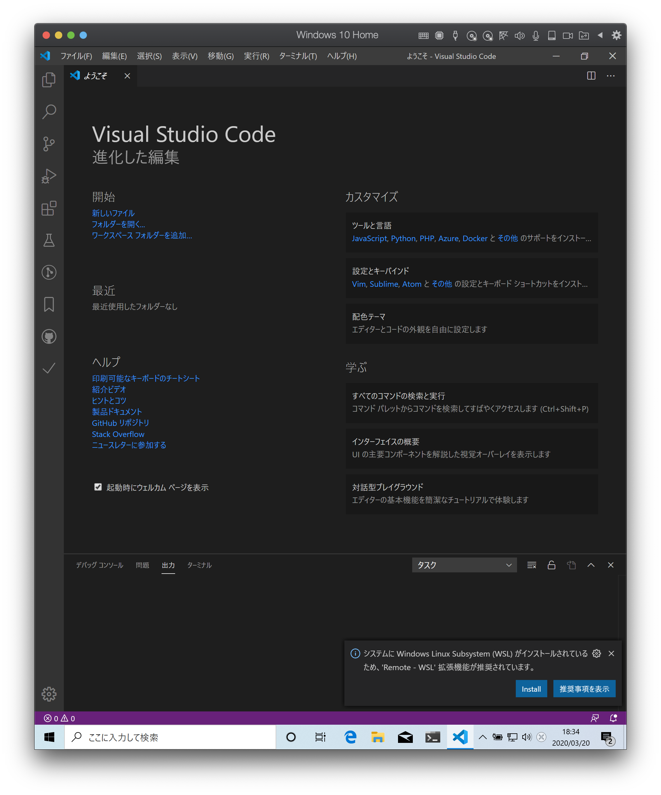

===== 設定

https://qiita.com/kinchiki/items/dabb5c890d9c57907503[Visual Studio Codeで簡単にショートカットキーを変更する方法]

===== Hello world

https://marketplace.visualstudio.com/items?itemName=buenon.scratchpads[Scratchpads]

==== 開発言語のセットアップ

===== Ruby環境のセットアップ

image::../../images/article/episode_0/wsl-012.png[]

===== プロビジョニングの実行

https://github.com/hiroshima-arc/tdd_rb[テスト駆動開発から始めるRuby入門^]

image::../../images/article/episode_0/provision-001.png[]
image::../../images/article/episode_0/provision-002.png[]
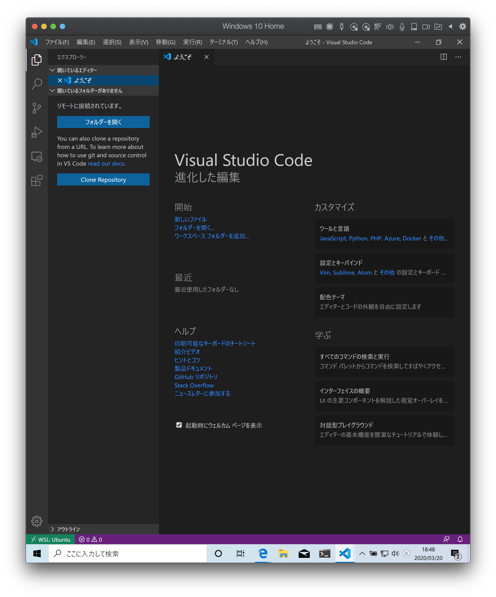
image::../../images/article/episode_0/provision-004.png[]
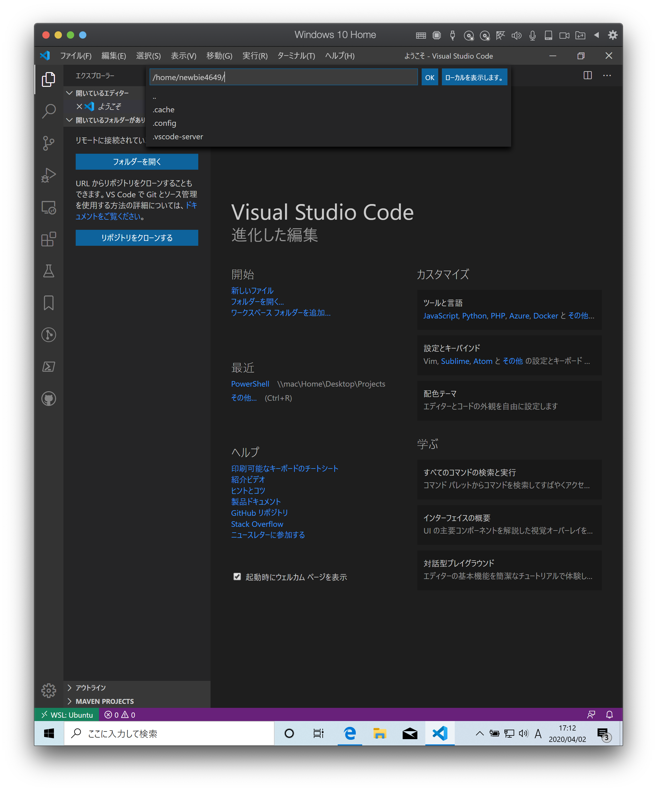
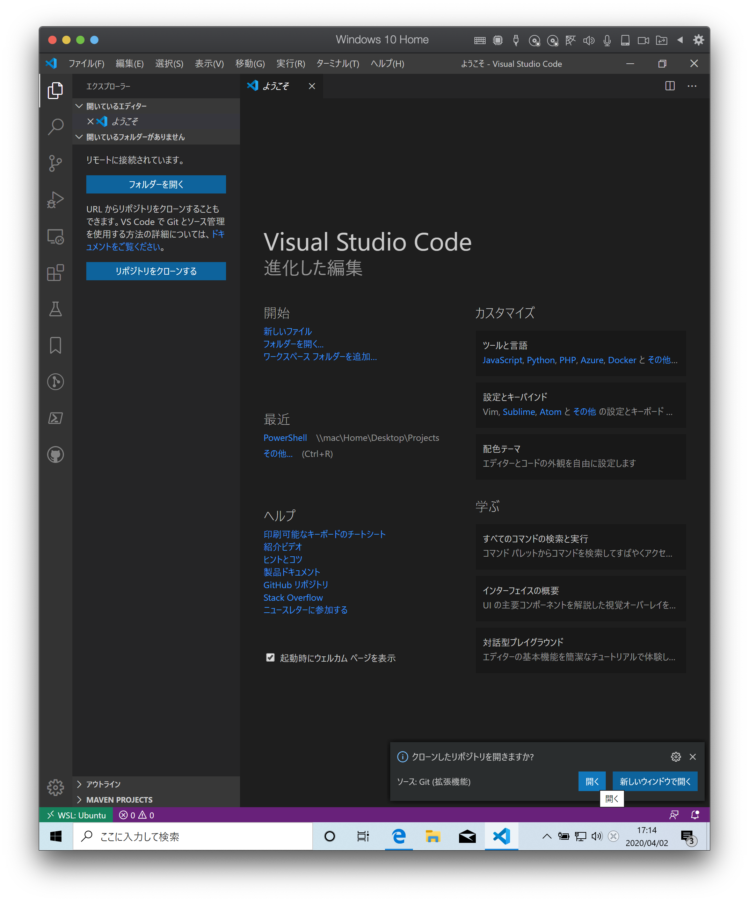
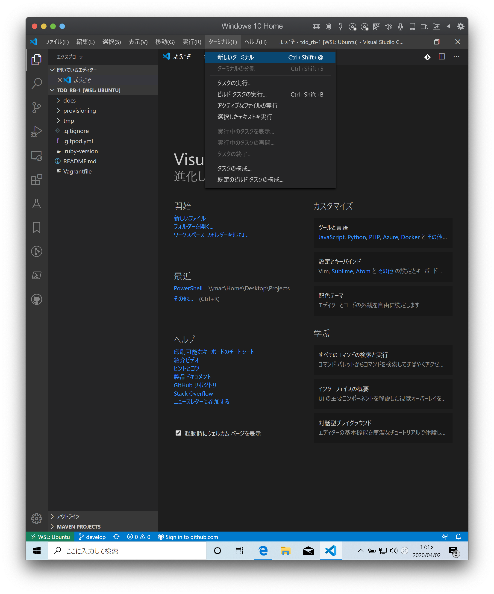
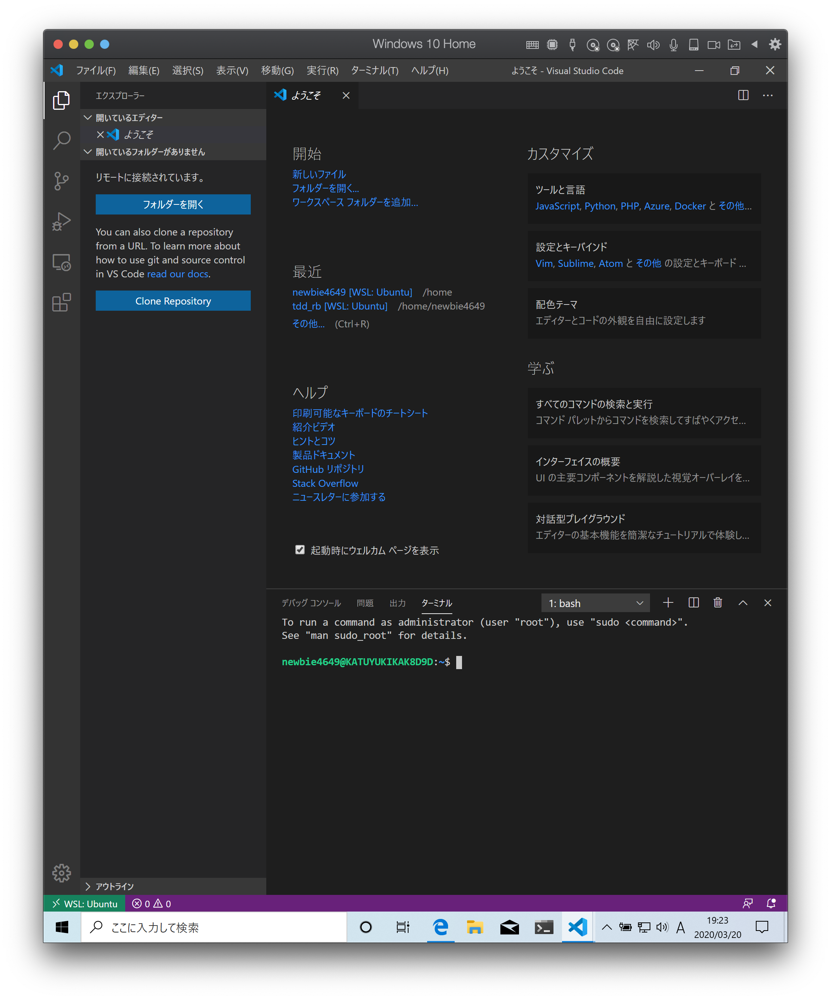

```bash
$ sudo apt-get update -y
[sudo] password for newbie4649:
...
$ sudo apt install ansible -y
$ cd provisioning/tasks/
$ sudo ansible-playbook --inventory=localhost, --connection=local site.yml
```

===== 追加パッケージのインストール

https://marketplace.visualstudio.com/items?itemName=rebornix.Ruby[Ruby for Visual Studio Code^]

https://marketplace.visualstudio.com/items?itemName=castwide.solargraph[Ruby Solargraph^]

https://marketplace.visualstudio.com/items?itemName=kaiwood.endwise[vscode-endwise^]

https://marketplace.visualstudio.com/items?itemName=misogi.ruby-rubocop[ruby-rubocop^]

https://marketplace.visualstudio.com/items?itemName=connorshea.vscode-ruby-test-adapter[Ruby Test Explorer^]


```bash
gem install rubocop
gem install debase
gem install ruby-debug-ide
gem install solargraph
```

===== 設定

https://qiita.com/code2545Light/items/ca61673c42fb26fc2d28[VisualStudioCode でRubyの開発環境を作る]

==== 参照

* https://note.com/yukionoguchi/n/n6fa36e6aff86[「超」整理法の思想^]
* https://at-jinji.jp/work/007[効率的な文書管理方法とは。保管方法、運用ルール作りの3ステップを紹介^]
* https://at-jinji.jp/blog/11259/[書類整理の基本は書類をためないこと！ 「『超』整理術」を簡単解説^]
* https://www.oreilly.com/library/view/the-pragmatic-programmer/9780135956977/[The Pragmatic Programmer: your journey to mastery, 20th Anniversary Edition, 2nd Edition^]
* https://www.itmedia.co.jp/pcuser/articles/1808/09/news035.html[子どもを守るITリテラシー学^]
* https://jaminlifelog.com/notes/work/clean-desktop-files[フォルダ管理の基本ルール5選！整理されていないデスクトップにさよならバイバイ！]
* https://support.microsoft.com/ja-jp/help/4026324/microsoft-account-how-to-create[新しい Microsoft アカウントを作成する方法^]
* https://qiita.com/kikutaro/items/0e5deb36047d0137a767[Java開発環境がすぐに作れる「Visual Studio Code Installer for Java」を試してみた]
* https://code.visualstudio.com/docs/languages/java[Java in Visual Studio Code]
* https://qiita.com/rubytomato@github/items/fdfc0a76e848442f374e[WSL (Windows Subsystem for Linux)の基本メモ]
* https://www.red-gate.com/simple-talk/sysadmin/powershell/practical-powershell-unit-testing-getting-started/[Practical PowerShell Unit-Testing: Getting Started]
* https://qiita.com/y-tsutsu/items/179717ecbdcc27509e5a[日頃お世話になっているElectronのアプリ開発に入門してみる]
* https://qiita.com/kai_kou/items/ceeee47996339e5eecc4[VSCodeの拡張機能「GIST」が便利すぎてHackMDを使うのをやめた]
